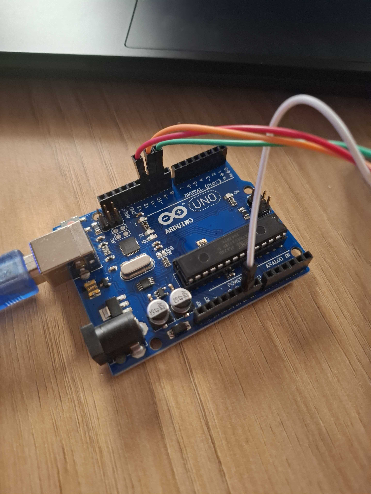
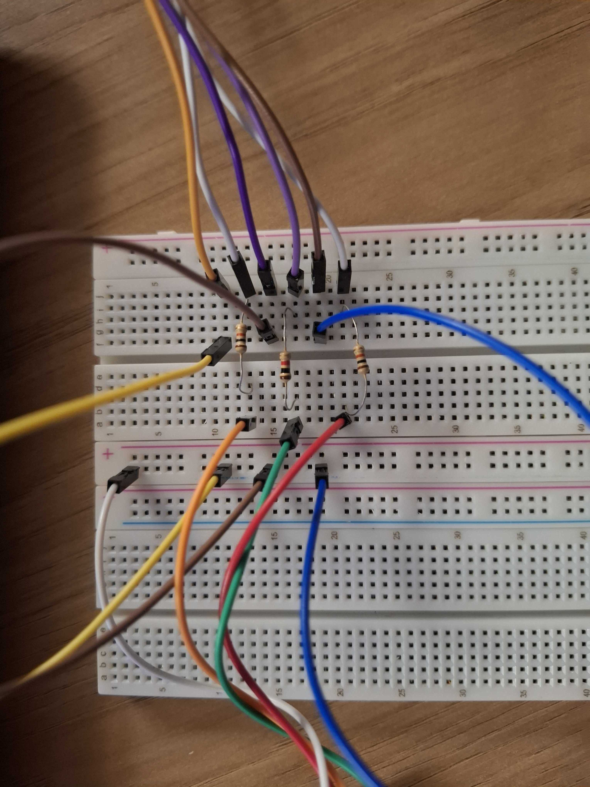
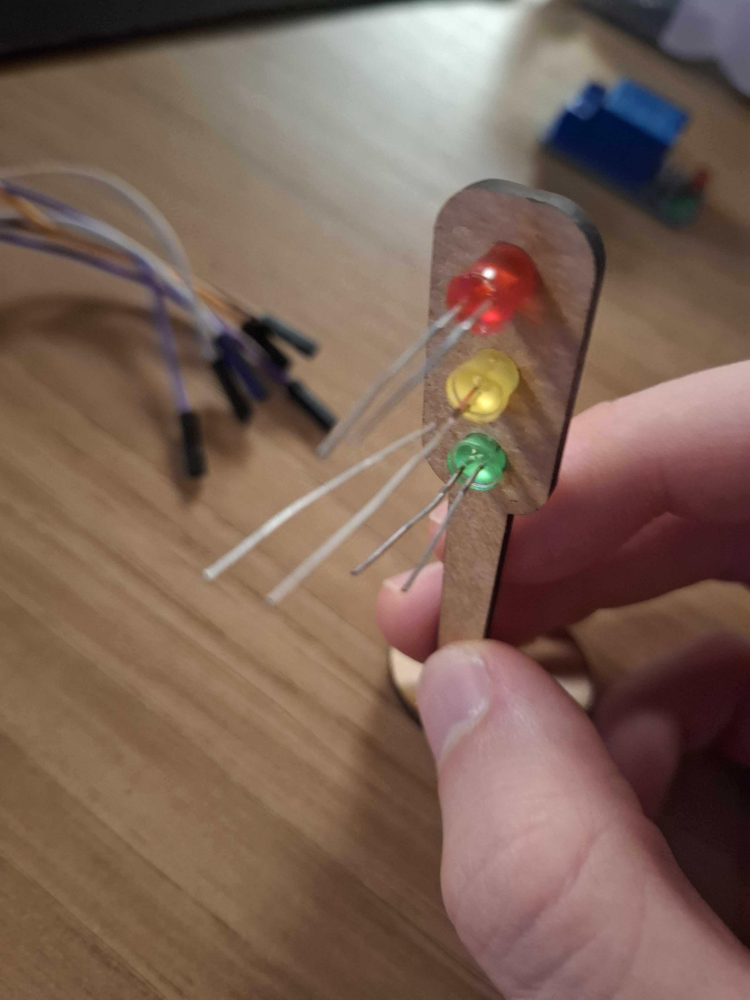

# Contextualização:

O projeto desenvolvido se trata de um sistema de semáforo offline. Ele busca alternar entre os leds acessos, simulando o equipamento real.

# Tabela de componentes:

**Nome do Componente** | **Quantidade** 
|----------|----------|
|LEDs coloridos | 3 |
| Resistores | 3 | 
| Arduino UNO | 1 | 
| Protoboard |  1 | 
|  Semáforo de madeira |  1 | 
|  Flats macho-macho | 6 | 
|  Flats macho-fêmea |  6 | 

# Análise do hardware:

Para o início da montagem, três flats foram ligados em pinos digitais do Arduino, e um no pino GND (Aterramento);

<div style="text-align:center">
  <p style="margin-bottom:8px;"><strong>Figura 1 — Arduino</strong></p>
  
  <p style="text-align:center; margin-top:8px; font-size:0.9em;">Fonte — Produção Autoral</p>
</div>

Depois, os cabos que estão ligados nos pinos digitais são contectados com resistores, para evitar que os LEDs acabem queimados. O flat ligado no GND é ligado na coluna "-", fornecendo aterramento para o circuito.

<div style="text-align:center">
  <p style="margin-bottom:8px;"><strong>Figura 2 — Protoboard</strong></p>
  
  <p style="text-align:center; margin-top:8px; font-size:0.9em;">Fonte — Produção Autoral</p>
</div>

Por fim, conforme na imagem abaixo, os LEDs foram conectados na estrutura de madeira. Depois, os cabos no fundo são conectados nas pernas correspondentes (positivo na perna grande, negativo na perna pequena).

<div style="text-align:center">
  <p style="margin-bottom:8px;"><strong>Figura 1 — Semáforo</strong></p>
  
  <p style="text-align:center; margin-top:8px; font-size:0.9em;">Fonte — Produção Autoral</p>
</div>

# Análise do código:

```C++
int vermelho = 10;
int *ptrVermelho = &vermelho;

int amarelo = 9;
int *ptrAmarelo = &amarelo;

int verde = 11;
int *ptrVerde = &verde;

void setup() {
  pinMode(*ptrVermelho, OUTPUT);
  pinMode(*ptrAmarelo, OUTPUT);
	pinMode(*ptrVerde, OUTPUT);
}

void ledSwap(int turnOn, int turnOff1, int turnOff2, int time){
  digitalWrite(turnOn, HIGH);
  digitalWrite(turnOff1, LOW);
  digitalWrite(turnOff2, LOW);
  delay(time);
}

void loop() {
  ledSwap(*ptrVermelho, *ptrAmarelo, *ptrVerde, 6000);
  ledSwap(*ptrVerde, *ptrVermelho, *ptrAmarelo, 4000);
  ledSwap(*ptrAmarelo, *ptrVermelho, *ptrVerde, 2000);
  }
```

O código apresenta algumas funcionalidades notáveis. A primeira dela é a utilização de ponteiros, permitindo uso efetivo da memória. Eles estão presentes no ínicio do código, na definição das variáveis dos pinos. Além disso, o código também apresenta a utilização de uma função para alterar as cores dos LEDs. A função ledSwap necessita de quatro parâmetros de entrada. O primeiro parâmetro é o LED que deverá ser acesso, os dois próximos são os LEDs à serem apagados, e o último é o tempo que ele deve ser mantido acesso.

O código faz com que o LED vermelho fique ligado por 6 segundos, depois o LED verde por 4 segundos, e por fim o amarelo por 2 segundos.

# Vídeo demonstrativo:


O vídeo está disponível [nesse link.](https://youtu.be/wcr04rXd-cc)


